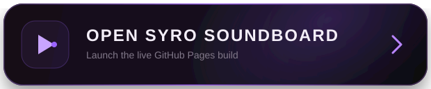

# Syro Soundboard

A fast, local-first soundboard and timeline audio workspace with a dark floating UI, animated purple accents, recording, shortcuts, live capture, and real-time Web Audio effects.

<p align="center">
  <a href="https://vnu1l.github.io/syro-soundboard/">
    
  </a>
</p>

## Highlights

- Context-aware sound pads with drag/drop, recording, copy/cut/paste, duplicate, shortcuts and multiple playback modes
- Real-time effect rack: Volume, Bass, Treble, Reverb, Echo, Pan, Low-pass, Drive, Compression and Pitch
- Built-in local Sound & FX Library with generated sounds and editable effect presets
- Timeline editor with zoom, middle-mouse panning, multi-select clips, pad/file drag-and-drop and timeline playback
- Live Timeline capture for Board output, Microphone and supported System/Tab audio as separate tracks
- First-run permission setup and a five-step interactive tutorial
- Permission helper screens when an action is blocked
- Full settings sections for General, Audio, Interface, Notifications, Permissions and Storage
- Smooth background/foreground notifications, undo/redo, autosave, IndexedDB audio storage and `.syroboard` backup export
- PWA/offline shell with update-friendly caching

## Run locally

Use any static HTTPS/localhost server. For example:

```bash
python3 -m http.server 4173
```

Then open `http://localhost:4173`.

## Browser notes

Microphone access requires a secure context and user permission. Notification permission should be requested from a user gesture, so Syro presents a one-click permission screen on first run. System/tab audio capture uses the browser screen-share picker and must be approved for each capture session. Global operating-system hotkeys still require a future desktop companion because a normal web page cannot reliably register Windows-wide shortcuts.
